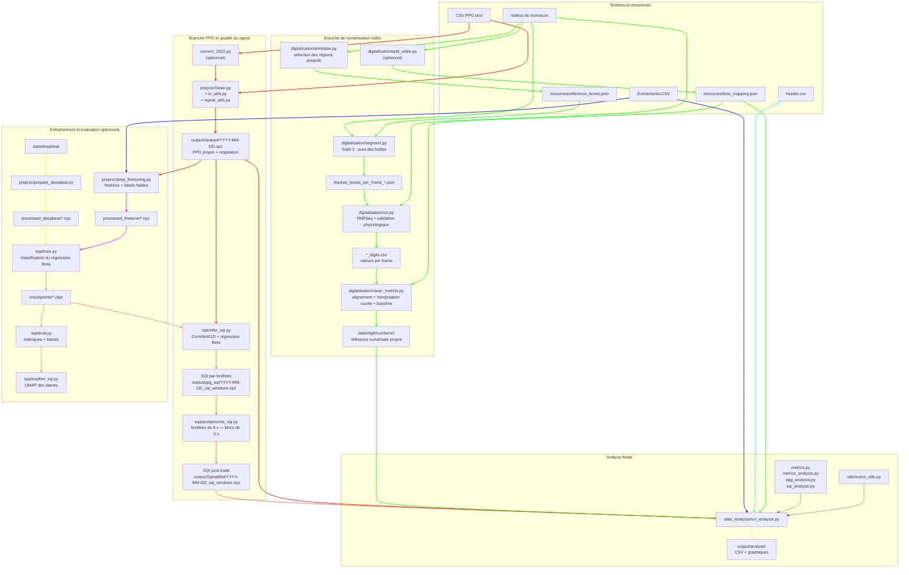

# Diagramme de blocs de Spinal

Spinal traite deux sources indépendantes jusqu'à l'étape d'analyse finale :

- signaux PPG multicanaux et multi-longueurs d'onde ;

- vidéos de moniteurs médicaux, numérisées par segmentation et OCR.

## Flux principal

## Lecture du diagramme
1. `clean.py` transforme les CSV PPG en fichiers `.npz` avec un signal propre et la respiration.
2. `infer_sqi.py` applique le modèle entraîné sur des fenêtres de 8 secondes ; `postprocess_sqi.py` les réorganise en blocs temporels de 2 secondes.
3. La branche vidéo génère une référence indépendante : `annotate.py` définit les ROI, `segment.py` les suit avec SAM 3, `ocr.py` extrait les nombres et `clean_metrcis.py` les aligne temporellement.
4. `run_analysis.py` est le point de convergence. Il calcule les métriques PPG, compare la qualité du signal et met en relation les résultats avec la référence numérisée et les événements.
5. `train.py`, `eval.py` et `explore_sqi.py` sont des outils optionnels pour entraîner, évaluer et explorer le modèle SQI ; ils ne font pas obligatoirement partie de l'analyse d'une session.

## Módulos transversales

- `src/dataset/utils/io_utils.py`: lecture de PPG, métadonnées et conversions temporelles.
- `src/dataset/utils/signal_utils.py`: filtres, rééchantillonnage, normalisation et opérations sur les blocs.
- `src/dataset/utils/event_utils.py`: événements et zones `PRE`, `DURING` et `POST`.
- `src/dataset/sqa/core_utils.py`: chargement et normalisation des checkpoints.
- `src/digitalisation/utils.py`: ID d'écran, plages physiologiques et opérations sur les ROI.
- `src/dataset/utils/visualization/`: graphiques de diagnostic de l'ETL et du SQI.

La branche PPG et la branche vidéo restent indépendantes jusqu'à `run_analysis.py`.
