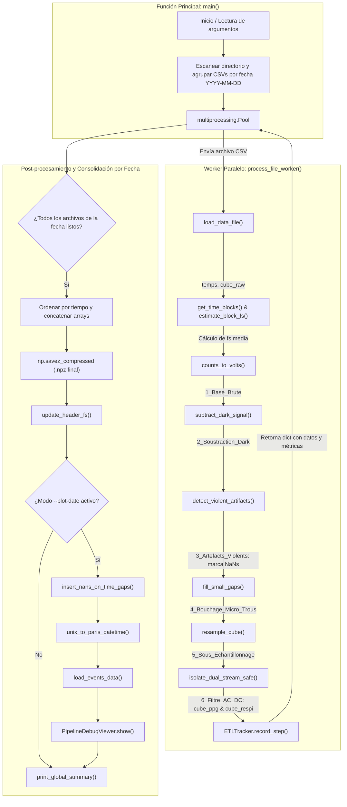

```mermaid
flowchart TD
    subgraph S_MAIN ["Función Principal: main()"]
        A["Inicio / Lectura de argumentos"] --> B["Escanear directorio y agrupar CSVs por fecha YYYY-MM-DD"]
        B --> C["multiprocessing.Pool"]
    end

    subgraph S_WORKER ["Worker Paralelo: process_file_worker()"]
        C -->|Envía archivo CSV| W1["load_data_file()"]
        W1 -->|temps, cube_raw| W2["get_time_blocks() & estimate_block_fs()"]
        W2 -->|Cálculo de fs media| W3["counts_to_volts()"]
        W3 -->|1_Base_Brute| W4["subtract_dark_signal()"]
        W4 -->|2_Soustraction_Dark| W5["detect_violent_artifacts()"]
        W5 -->|3_Artefacts_Violents: marca NaNs| W6["fill_small_gaps()"]
        W6 -->|4_Bouchage_Micro_Trous| W7["resample_cube()"]
        W7 -->|5_Sous_Echantillonnage| W8["isolate_dual_stream_safe()"]
        W8 -->|6_Filtre_AC_DC: cube_ppg & cube_respi| W9["ETLTracker.record_step()"]
        W9 -->|Retorna dict con datos y métricas| C
    end

    subgraph S_POST ["Post-procesamiento y Consolidación por Fecha"]
        C --> D{"¿Todos los archivos de la fecha listos?"}
        D -->|Sí| E["Ordenar por tiempo y concatenar arrays"]
        E --> F["np.savez_compressed (.npz final)"]
        F --> G["update_header_fs()"]
        
        G --> H{"¿Modo --plot-date activo?"}
        H -->|Sí| I["insert_nans_on_time_gaps()"]
        I --> J["unix_to_paris_datetime()"]
        J --> K["load_events_data()"]
        K --> L["PipelineDebugViewer.show()"]
        H -->|No| M["print_global_summary()"]
        L --> M
    end
```
