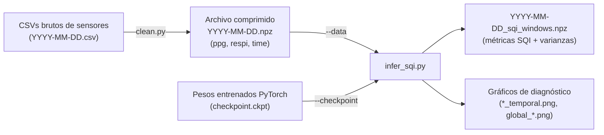

```mermaid
flowchart LR
    A["CSVs brutos de sensores<br/>(YYYY-MM-DD.csv)"] -->|clean.py| B["Archivo comprimido<br/>YYYY-MM-DD.npz<br/>(ppg, respi, time)"]
    B -->|--data| C["infer_sqi.py"]
    D["Pesos entrenados PyTorch<br/>(checkpoint.ckpt)"] -->|--checkpoint| C
    C --> E["YYYY-MM-DD_sqi_windows.npz<br/>(métricas SQI + varianzas)"]
    C --> F["Gráficos de diagnóstico<br/>(*_temporal.png, global_*.png)"]
```
