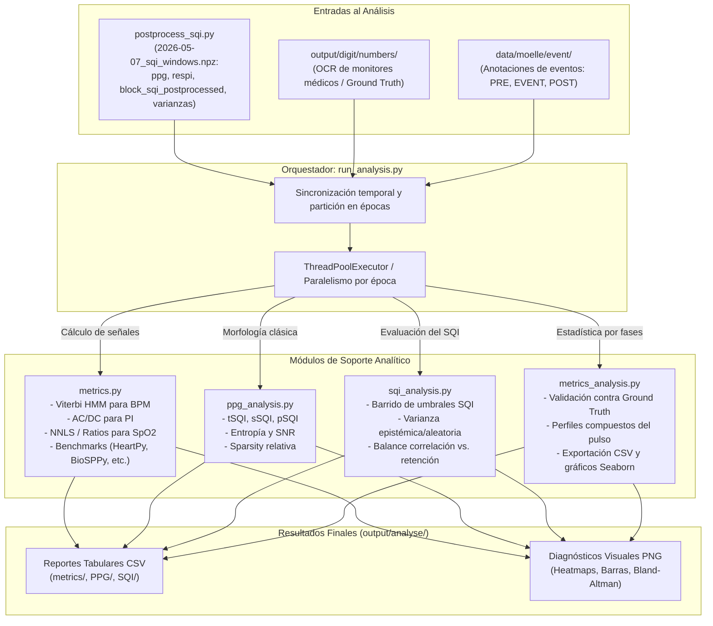

```mermaid
flowchart TD
    subgraph IN ["Entradas al Análisis"]
        POST["postprocess_sqi.py<br/>(2026-05-07_sqi_windows.npz:<br/>ppg, respi, block_sqi_postprocessed, varianzas)"]
        OCR["output/digit/numbers/<br/>(OCR de monitores médicos / Ground Truth)"]
        EV["data/moelle/event/<br/>(Anotaciones de eventos: PRE, EVENT, POST)"]
    end

    subgraph ORCH ["Orquestador: run_analysis.py"]
        SYNC["Sincronización temporal y partición en épocas"]
        POOL["ThreadPoolExecutor / Paralelismo por época"]
    end

    subgraph LIBS ["Módulos de Soporte Analítico"]
        M1["metrics.py<br/>- Viterbi HMM para BPM<br/>- AC/DC para PI<br/>- NNLS / Ratios para SpO2<br/>- Benchmarks (HeartPy, BioSPPy, etc.)"]
        M2["ppg_analysis.py<br/>- tSQI, sSQI, pSQI<br/>- Entropía y SNR<br/>- Sparsity relativa"]
        M3["sqi_analysis.py<br/>- Barrido de umbrales SQI<br/>- Varianza epistémica/aleatoria<br/>- Balance correlación vs. retención"]
        M4["metrics_analysis.py<br/>- Validación contra Ground Truth<br/>- Perfiles compuestos del pulso<br/>- Exportación CSV y gráficos Seaborn"]
    end

    subgraph OUT ["Resultados Finales (output/analyse/)"]
        CSV["Reportes Tabulares CSV<br/>(metrics/, PPG/, SQI/)"]
        PLOTS["Diagnósticos Visuales PNG<br/>(Heatmaps, Barras, Bland-Altman)"]
    end

    POST --> SYNC
    OCR --> SYNC
    EV --> SYNC
    SYNC --> POOL

    POOL -->|Cálculo de señales| M1
    POOL -->|Morfología clásica| M2
    POOL -->|Evaluación del SQI| M3
    POOL -->|Estadística por fases| M4

    M1 & M2 & M3 & M4 --> CSV
    M1 & M2 & M3 & M4 --> PLOTS
```
