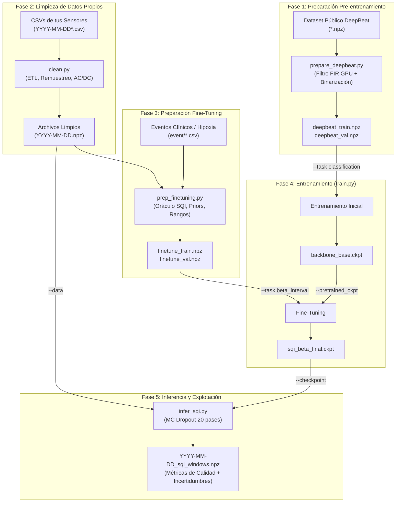

```mermaid
flowchart TD
    subgraph S1 ["Fase 1: Preparación Pre-entrenamiento"]
        DB_RAW["Dataset Público DeepBeat<br/>(*.npz)"] --> PREP_DB["prepare_deepbeat.py<br/>(Filtro FIR GPU + Binarización)"]
        PREP_DB --> DB_PROC["deepbeat_train.npz<br/>deepbeat_val.npz"]
    end

    subgraph S2 ["Fase 2: Limpieza de Datos Propios"]
        CSV_RAW["CSVs de tus Sensores<br/>(YYYY-MM-DD*.csv)"] --> CLEAN["clean.py<br/>(ETL, Remuestreo, AC/DC)"]
        CLEAN --> NPZ_CLEAN["Archivos Limpios<br/>(YYYY-MM-DD.npz)"]
    end

    subgraph S3 ["Fase 3: Preparación Fine-Tuning"]
        NPZ_CLEAN --> PREP_FT["prep_finetuning.py<br/>(Oráculo SQI, Priors, Rangos)"]
        EVENTS["Eventos Clínicos / Hipoxia<br/>(event/*.csv)"] --> PREP_FT
        PREP_FT --> FT_PROC["finetune_train.npz<br/>finetune_val.npz"]
    end

    subgraph S4 ["Fase 4: Entrenamiento (train.py)"]
        DB_PROC -->|--task classification| TR1["Entrenamiento Inicial"]
        TR1 --> CKPT_PRE["backbone_base.ckpt"]
        
        FT_PROC -->|--task beta_interval| TR2["Fine-Tuning"]
        CKPT_PRE -->|--pretrained_ckpt| TR2
        TR2 --> CKPT_FINAL["sqi_beta_final.ckpt"]
    end

    subgraph S5 ["Fase 5: Inferencia y Explotación"]
        NPZ_CLEAN -->|--data| INF["infer_sqi.py<br/>(MC Dropout 20 pases)"]
        CKPT_FINAL -->|--checkpoint| INF
        INF --> OUT_SQI["YYYY-MM-DD_sqi_windows.npz<br/>(Métricas de Calidad + Incertidumbres)"]
    end
```
