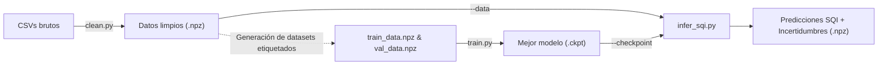

```mermaid
flowchart LR
    A["CSVs brutos"] -->|clean.py| B["Datos limpios (.npz)"]
    B -.->|Generación de datasets etiquetados| C["train_data.npz & val_data.npz"]
    C -->|train.py| D["Mejor modelo (.ckpt)"]
    B -->|--data| E["infer_sqi.py"]
    D -->|--checkpoint| E
    E --> F["Predicciones SQI + Incertidumbres (.npz)"]
```
