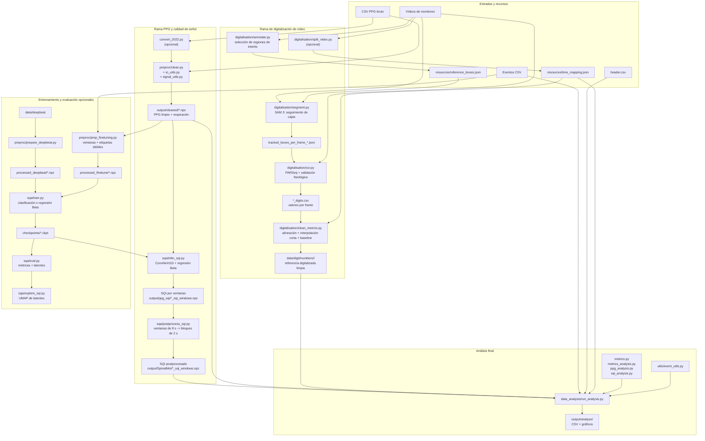

```mermaid
flowchart TD
    subgraph ENTRADAS[Entradas y recursos]
        PPG0["CSV PPG bruto"]
        VID0["Vídeos de monitores"]
        EVENTS["Eventos CSV"]
        HEADER["header.csv"]
        MAP["resources/time_mapping.json"]
        BOXES["resources/reference_boxes.json"]
    end

    subgraph PPG["Rama PPG y calidad de señal"]
        CONVERT["convert_2022.py\n(opcional)"]
        CLEAN["preproc/clean.py\n+ io_utils.py\n+ signal_utils.py"]
        CLEANED["output/cleaned/*.npz\nPPG limpio + respiración"]
        INFER["sqa/infer_sqi.py\nConvNeXt1D + regresión Beta"]
        RAW["SQI por ventanas\noutput/ppg_sqi/*_sqi_windows.npz"]
        POST["sqa/postprocess_sqi.py\nventanas de 8 s -> bloques de 2 s"]
        SQI["SQI postprocesado\noutput/SpinalMot/*_sqi_windows.npz"]

        PPG0 --> CONVERT
        PPG0 --> CLEAN
        CONVERT --> CLEAN
        CLEAN --> CLEANED
        CLEANED --> INFER
        INFER --> RAW
        RAW --> POST
        POST --> SQI
    end

    subgraph VIDEO["Rama de digitalización de vídeo"]
        SPLIT["digitalisation/split_video.py\n(opcional)"]
        ANNOTATE["digitalisation/annotate.py\nselección de regiones de interés"]
        SEGMENT["digitalisation/segment.py\nSAM 3: seguimiento de cajas"]
        TRACKED["tracked_boxes_per_frame_*.json"]
        OCR["digitalisation/ocr.py\nPARSeq + validación fisiológica"]
        DIGITS["*_digits.csv\nvalores por frame"]
        CLEAN_DIGITS["digitalisation/clean_metrcis.py\nalineación + interpolación corta + baseline"]
        REFERENCE["data/digit/numbers/<DATE>/\nreferencia digitalizada limpia"]

        VID0 --> SPLIT
        VID0 --> ANNOTATE
        VID0 --> SEGMENT
        SPLIT --> MAP
        ANNOTATE --> BOXES
        BOXES --> SEGMENT
        SEGMENT --> TRACKED
        TRACKED --> OCR
        VID0 --> OCR
        OCR --> DIGITS
        DIGITS --> CLEAN_DIGITS
        MAP --> CLEAN_DIGITS
        CLEAN_DIGITS --> REFERENCE
    end

    subgraph TRAIN["Entrenamiento y evaluación opcionales"]
        DEEPBEAT["data/deepbeat"]
        PREP_DB["preproc/prepare_deepbeat.py"]
        DB_DATA["processed_deepbeat/*.npz"]
        PREP_FT["preproc/prep_finetuning.py\nventanas + etiquetas débiles"]
        FT_DATA["processed_finetune/*.npz"]
        TRAIN_MODEL["sqa/train.py\nclasificación o regresión Beta"]
        CHECKPOINT["checkpoints/*.ckpt"]
        EVAL["sqa/eval.py\nmétricas + latentes"]
        EXPLORE["sqa/explore_sqi.py\nUMAP de latentes"]

        DEEPBEAT --> PREP_DB --> DB_DATA --> TRAIN_MODEL
        CLEANED --> PREP_FT
        EVENTS --> PREP_FT
        PREP_FT --> FT_DATA --> TRAIN_MODEL
        TRAIN_MODEL --> CHECKPOINT
        CHECKPOINT --> INFER
        CHECKPOINT --> EVAL
        EVAL --> EXPLORE
    end

    subgraph ANALYSIS["Análisis final"]
        ANALYZE["data_analysis/run_analysis.py"]
        METRICS["metrics.py\nmetrics_analysis.py\nppg_analysis.py\nsqi_analysis.py"]
        EVENT_UTILS["utils/event_utils.py"]
        RESULTS["output/analyse/\nCSV + gráficos"]

        SQI --> ANALYZE
        CLEANED --> ANALYZE
        REFERENCE --> ANALYZE
        EVENTS --> ANALYZE
        HEADER --> ANALYZE
        MAP --> ANALYZE
        METRICS --> ANALYZE
        EVENT_UTILS --> ANALYZE
        ANALYZE --> RESULTS
    end
```
